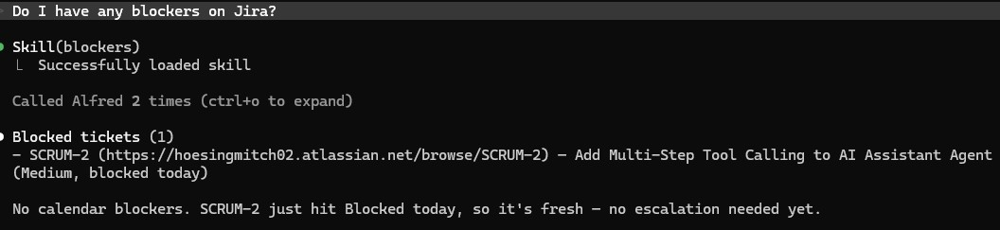

# Blockers

Surface anything that's currently obstructing forward progress.

## Steps

1. **Blocked Jira tickets.**
   - `jira_search_jql(jql='assignee = currentUser() AND status = "Blocked" ORDER BY updated DESC', limit=15)`
   - For each, note the summary and how long it's been stuck (today's date minus `updated_at`). Stale blockers (≥ 7 days) deserve a callout.

2. **Calendar events flagged as blockers.**
   - `alfred_search(query="blocker OR blocked", sources=["google_calendar"], limit=10)`
   - These are typically meetings tagged with "blocker review" or events Mitch added explicitly to track an external dependency. Show title + start time.

## Output format

```
**Blocked tickets** (N)
- ALF-7 — Waiting on platform team for token rotation API (stuck 12 days ⚠️)
- ALF-19 — Need design review from Alice (stuck 3 days)

**Calendar blockers**
- 2026-05-08 14:00 — "Blocker review: vendor SLA"
```

Mark anything stuck ≥ 7 days with a ⚠️ — those are the ones that need escalation, not just patience.

If both lists are empty, say "Nothing flagged as blocked. Onward."

## Notes

- "Blocked" must match Mitch's Jira status name exactly; if his board uses "Stalled" or "Waiting" instead, swap the JQL accordingly.
- Don't list tickets that are merely *In Progress* and slow — only the explicit Blocked status counts here. Use `daily-briefing` for general status.

## Demo

Example invocation and output:


