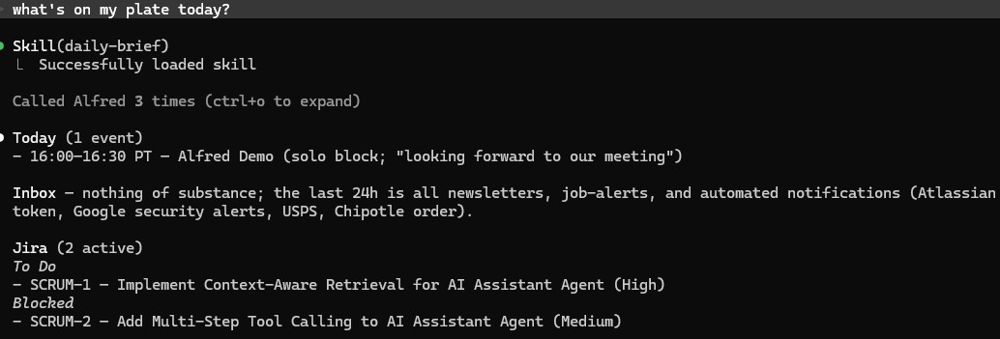

# Daily Briefing

Pull together a short morning summary by querying all three Alfred sources and synthesizing the result into a few short sections.

## Steps

1. **Compute today's window.** Use the user's local date. The window is `[today 00:00, tomorrow 00:00]` in the user's local timezone, expressed as ISO 8601 with offset.

2. **Today's schedule** — `calendar_list_events_in_range(time_min, time_max, limit=50)`. Use the **start time** of each event, sorted earliest first. Provide a summarized description of the event. Skip events without attendees if there are too many to fit (those tend to be auto-blocks).

3. **Unread mail (last 24h)** — `alfred_search(query="is:unread newer_than:1d", sources=["gmail"], limit=200)`. Restricts to messages received within the last 24 hours; pass a large limit so the cap doesn't truncate results. Filter out obvious noise (newsletters, calendar invites that are already on the schedule). Surface ~3–5 messages worth Mitch's attention. Show sender + subject. Do not include potentially sensitive information.

4. **Active Jira tickets** — `jira_search_jql(jql="assignee = currentUser() AND status != Done ORDER BY priority DESC, updated DESC", limit=15)`. Group by status (e.g. *In Progress*, *To Do*, *Blocked*).

## Output format

Three short sections, in this order:

```
**Today** (N events)
- 09:00–09:30 — Standup
- 10:00–11:00 — 1:1 with Alice - Description - 1:1 meeting with Alice regarding Q2 Planning
...

**Inbox** (M unread of interest)
- Alice Smith — "Re: Q2 Planning"
...

**Jira** (P active)
*In Progress*
- ALF-12 — Implement Gmail adapter (High)
*Blocked*
- ALF-7 — Auth refresh in CI (Medium)
```

Keep it terse. Mitch reads this once over coffee — no headers, no preamble, no closing summary.

## Failure handling

If any source returns an error or is unconfigured, omit its section and prefix the briefing with a one-line note: `_(Gmail unavailable: <reason>)_`. Do not abort the whole briefing.

## Demo

Example invocation and output:


