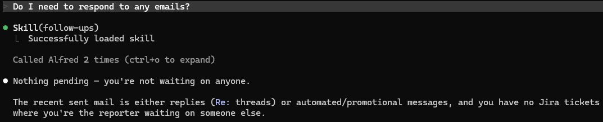

# Follow-ups

Cross-reference recent sent emails against incoming replies and find Jira tickets where Mitch reported the work but isn't the assignee.

## Steps

1. **Recent sent mail with no reply.**
   - `alfred_search(query="from:me newer_than:14d", sources=["gmail"], limit=200)`
   - For each result whose subject doesn't start with `Re:` (i.e., Mitch initiated the thread), call `gmail_get_thread(thread_id)` to fetch the full thread. Skip messages older than 3 days (too soon to chase).
   - A thread is a "waiting" thread if the **last message's sender is Mitch** (no one has replied since). Surface those.

2. **Tickets reported by Mitch but assigned to someone else.**
   - `jira_search_jql(jql="reporter = currentUser() AND assignee != currentUser() AND status != Done ORDER BY updated ASC", limit=20)`
   - Sort by least-recently-updated first — the longer it's been silent, the more it deserves attention.

## Output format

```
**Waiting on email replies**
- Alice Smith — "Re: Q2 Planning Doc" (sent 2026-05-02, no reply)
- Bob — "Architecture review request" (sent 2026-04-28, no reply)

**Tickets assigned to others**
- ALF-23 — assignee: Alice — *In Review* — last updated 2026-04-22
- ALF-31 — assignee: Bob — *To Do* — last updated 2026-04-15 (oldest)
```

If a category is empty, skip its heading entirely. If both are empty, say "Nothing pending — you're not waiting on anyone."

## Notes

- "newer_than:14d" is a Gmail search operator; pass it through `alfred_search`'s `query` argument.
- Don't fetch every thread — cap at the top 20 sent messages and stop iterating once you have ~5 worth surfacing.

## Demo

Example invocation and output:


