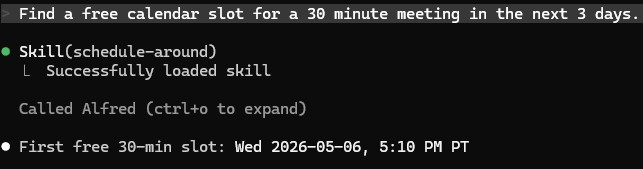

# Schedule Around

Find the first chunk of free time that accommodates the requested duration.

## Steps

1. **Parse the request.** Extract:
   - `duration_minutes` — explicit ("30-min meeting") or inferred ("a quick chat" → 15, "a deep-work block" → 90).
   - `within_days` — explicit ("this week" → 5, "next 3 days" → 3) or default to 7.

2. **Call** `calendar_find_free_slot(duration_minutes, within_days)`.

3. **Interpret the result.**
   - If a datetime is returned, convert to the user's local timezone and present as `YYYY-MM-DD HH:MM` plus the day name (e.g. "Wednesday at 2:30 PM").
   - If `null`, the search window has no qualifying gap. Tell Mitch and suggest broadening the window (`within_days` → larger) or shortening the duration.

## Output format

Slot found:
```
First free 30-min slot: **Wed 2026-05-07, 2:30 PM**
```

No slot found:
```
No 90-min gap in the next 7 days. Try a shorter duration or extend the window.
```

Be terse. This skill is conversational — usually a follow-up to "find time for X."

## Notes

- The tool searches `[now, now + within_days]` in UTC. Day boundaries are not respected — a returned slot may be 5 AM on Saturday if that's the first gap. If Mitch wants working-hours-only logic, that's a v2 feature, not v1.
- For one-off conflicts ("schedule around my flight"), skill currently has no special handling — Mitch will need to add the conflict to his calendar first.

## Demo

Example invocation and output:


